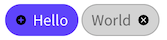

# Xamarin.Forms.Chips
*Chip support for Xamarin.Forms*



NuGet package available at https://www.nuget.org/packages/Xamarin.Forms.Chips/

## Usage

Import the Chips assembly:
```xaml
xmlns:chips="clr-namespace:Xamarin.Forms.Chips;assembly=Xamarin.Forms.Chips"
```

And place it in your view:
```xaml
<chips:Chip
    Text="Hello"
    OnClicked="Chip_Clicked" />
```

More advanced example:
```xaml
<chips:Chip
    Style="{Binding ChipStyle}"
    Image="https://path.to.image/image.png"
    CloseImage="https://path.to.image/close.png"
    IsToggleable="True"
    AutoToggle="True"
    OnClose="Chip_Closed"
    Text="World"
    IsSelected="{Binding IsEnabled, Mode=OneWay}"
    ClickedCommand="{Binding ChipClickedCommand}"
    ClickedCommandParameter="{Binding SomeParameter}"
    SelectCommand="{Binding ChipSelectedCommand}"
    SelectCommandParameter="{Binding SomeParameter}"
    UnselectCommand="{Binding ChipUnselectedCommand}"
    UnselectCommandParameter="{Binding SomeParameter}">
    <VisualStateManager.VisualStateGroups>
        <VisualStateGroup x:Name="CommonStates">
            <VisualState x:Name="Selected">
                <VisualState.Setters>
                    <Setter Property="Style" Value="{StaticResource ChipStyleSelected}" />
                    <Setter Property="CloseImage" Value="SelectedChipCloseImage" />
                </VisualState.Setters>
            </VisualState>
            <VisualState x:Name="Normal">
                <VisualState.Setters>
                    <Setter Property="Style" Value="{StaticResource ChipStyleSelectable}" />
                    <Setter Property="CloseImage" Value="UnselectedChipCloseImage" />
                </VisualState.Setters>
            </VisualState>
        </VisualStateGroup>
    </VisualStateManager.VisualStateGroups>
</chips:Chip>
```

See [Chip.xaml.cs](Xamarin.Forms.Chips/Chip.xaml.cs) for all bindable properties.
